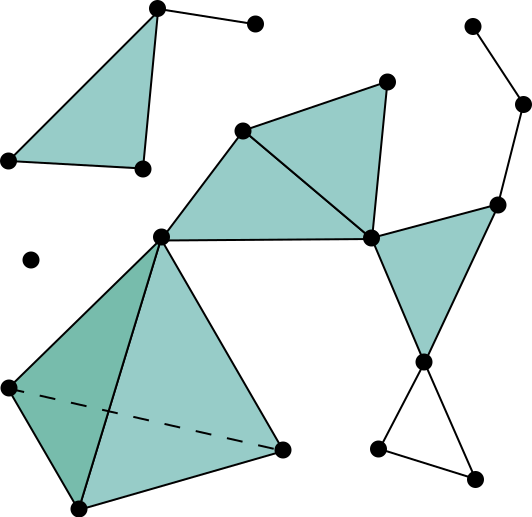
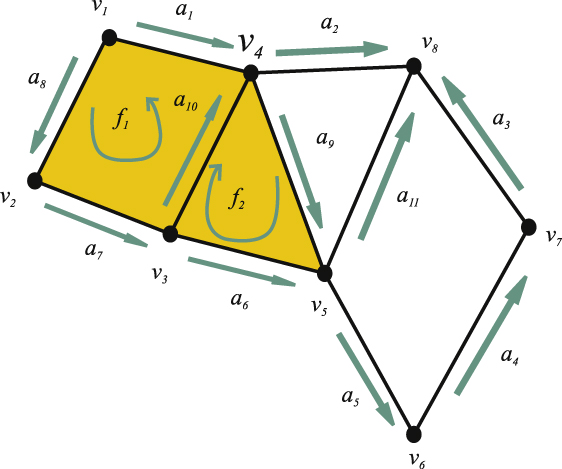
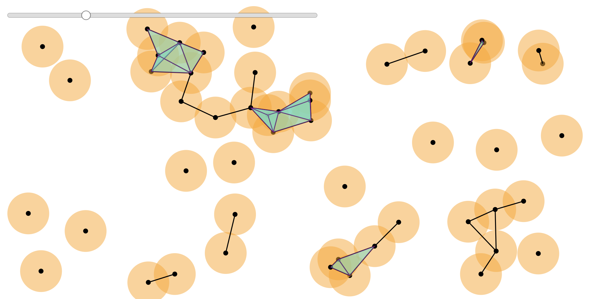
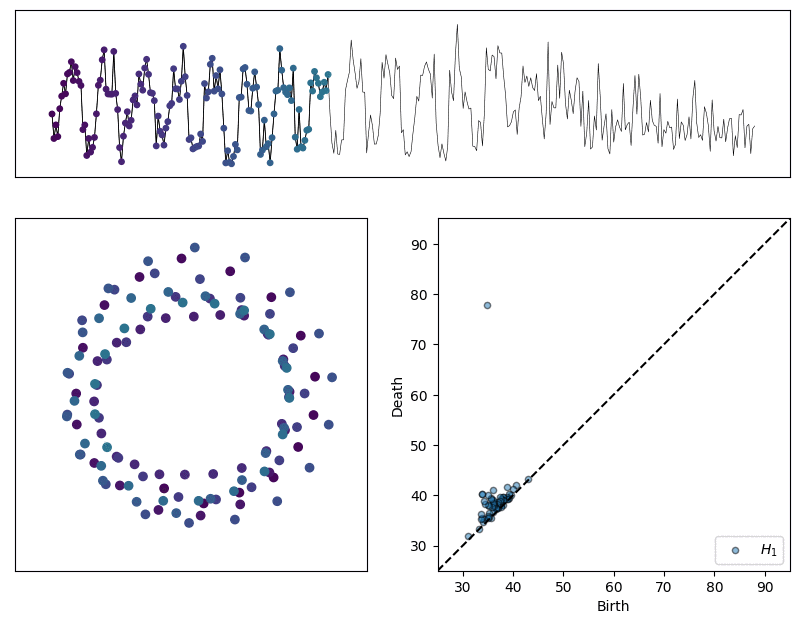
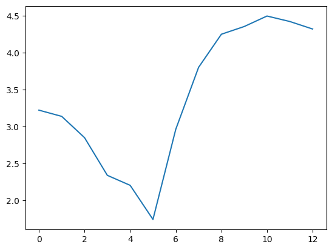
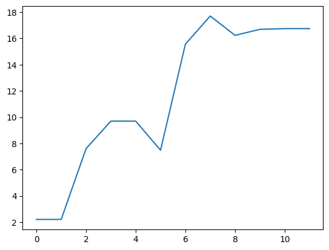
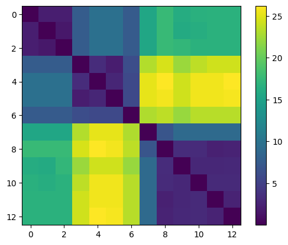

class: center, middle, borderless

# TDA of timeseries

### A introduction and case study of Topological Data Analysis.

<b>Nathaniel Rivera Saul</b> 
.smallish[New Relic Unconf June 13th 2019]

---

class: center, middle, qs

<!-- Topological Data Analysis is a new field of applicable mathematics gaining attention in the world of data science. This talk will introduce everything TDA working from holes and nerves to persistence. We'll then explore an application of TDA to time series analysis using new open source tools.  -->

# Topological Data Analysis

**What is topology?**

**Persistent Homology**

~~**Mapper**~~

 
# Case Study

**Anomaly Detection**

---

# What is Topology?

.center[
*Something about* **donuts** *and* **coffee cups**?
]

---

## What is Topology?

.center[study of shape, holes, and connectivity.

.fit[]
]

.footnote[Image credit Henry Segerman]

---

## What is Topological Data Analysis?

.center[
apply these theories to high dimensional point cloud data

.fit[
]
]

---

## Clustering is TDA!

.cols[
.fifty[
.fit[]
]

.fifty[
.fit[]
]
]

.center[zero dimensional holes]

---

## High dimensional holes

.cols[
.thirty[
.center[
.fit[]

1d holes = loops
]]

.thirty[
.center[
.fit[]

2d holes = voids
]]

.thirty[
.center[
.fit[]

lots of combinations
]
]
]

---

class: center, middle, qs

# Persistent Homology

 

**Simplicial Complexes**

**Homology**

**Persistence & Filtrations**

**Persistent Homology & Diagrams**

---

class: center

## Simplicial Complexes

.center[
.fitheight[]
]

.footnote[Image credit wikipedia?]

---

class: center

## Compute homology

Count the k-**cycles** that are not **boundaries** of k+1-cycles

.fitheight[]

---

class: center

## Data &rarr; Complex

---

class: center

## Data &rarr; Complex

---

class: center, middle

# One radius can be misleading

---

class: center, middle

# tinyurl.com/cech-playground

---

## Persistent homology

.center[
.fitheight[]
]

.footnote[Image credit Robert Ghrist]

---

## Persistence diagrams

.cols[
.thirty[
.center[.fit[] .fit[]]
]
.thirty[
.center[.fit[] .fit[]]
]
.thirty[
.center[.fit[] .fit[]]
]
]

---

class: center, middle, qs

### Case Study

 
 

# TDA of timeseries

**Spike detection**

**Change detection**

---

class: center, middle

Collect data with chart builder

---

class: center, middle

Can we use TDA to detect this spike?

---

class: center, middle, qs

## Processing steps

 

**Compute length of a period using autocorrelation**

**Construct sliding window embedding for normal wave and spike**

**Compare Persistence Diagrams of both embedding**

---

class: center, middle

Compute period from autocorrelation curve

---

class: center, middle

Pretty okay automatic identification ¯\\\_(ツ)\_/¯

---

class: center, middle

Window size of 30 &rarr; 30 dimensional space.

Slide window length 30 over series.

Each window becomes 30-D vector.

.footnote[please let me know if you have a nice way of visualizing this.]

---

class: center, middle

---

class: center, middle

---

class: center

# Woah those look pretty different to me.

---

class: center

But looks aren't everything.

Can't we automatically tell if they are different?

---

class: center, middle, qs

### Case study

## Change detection

Can we tell this periodic signal _fell apart_?

---

class: center, middle

Detect length period

Embed 10 periods

Persistence Diagrams for each group

---

class: center, middle

<!--  -->

---

class: center, middle, qs

## Automatic detection

 

**Divergence of distances?**

**Changes in persistent entropy?**

**IDK**

---

class: center, middle

## Max bar

---

class: center, middle

## Persistent entropy

(provably better stability properties, but IDK how it's calculated)

---

class: center, middle

## Wasserstein distances

---

class: center, middle

## Wasserstein distance curve

Comparing first diagram to subsequence diagrams using Wasserstein distance

---

class: center, middle

## Wasserstien distance matrix

---

class: center, middle

## Bottleneck distances

---

class: center, middle

## Bottleneck curve

Comparing first diagram to subsequent

---

class: center, middle

## Bottleneck distance matrix

---

name: questions
class: center, middle, qs

# Questions?

.cols[
.thirty[
 

### Learn more

]
.thirty[

 

&#10132;
]

.thirty[
<i class="fab fa-slack"></i> 
@nriverasaul

<i class="fas fa-globe"></i>  
www.scikit-tda.org
]

]

 
 Thank you to &#9734; Christopher Tralie &#9734;

---

class: outline

# References

All code and data to replicate what is shown here:

- [source.github.com/insights/data-driven-exploration/TDAtimeseries](https://source.datanerd.us/insights/data-driven-exploration/blob/master/TDAtimeseries/TDA%20of%20Timeseries.ipynb)

Embedding technique:

- (Quasi)Periodicity Quantification in Video Data, Using Topology, Christopher J. Tralie, Jose A. Perea, https://arxiv.org/abs/1704.08382

All TDA libraries used are part of Scikit-TDA:

- [www.scikit-tda.org](https://www.scikit-tda.org)
