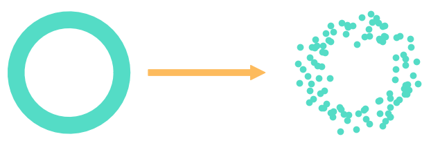
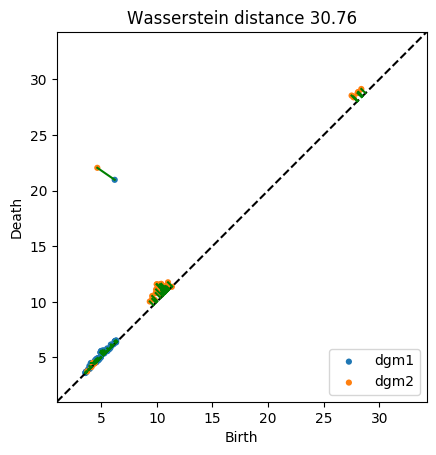
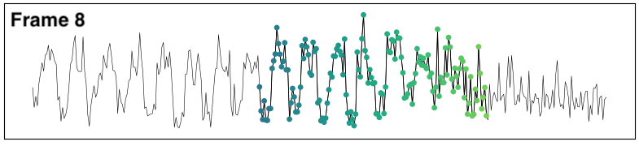

class: center, middle, borderless

# TDA of timeseries

An introduction and case study.

<b>Nathaniel Rivera Saul</b> 
.smallish[New Relic ML Unconf June 13th 2019]

---

class: center, middle, qs

<!-- Topological Data Analysis is a new field of applicable mathematics gaining attention in the world of data science. This talk will introduce everything TDA working from holes and nerves to persistence. We'll then explore an application of TDA to time series analysis using new open source tools.  -->

# Outline

**Topology**

**Persistent Homology**

**Case Study**

**Timeseries Anomaly Detection**

---

class: center, middle

## Topology

_Something about_ **donuts** _and_ **coffee cups**?

---

class: center, middle

## Topology

.center[study of _shape_, **holes**, and **_connectivity_**.

.fit[]
]

.footnote[Image credit Henry Segerman]

---

class: center, middle

## Topological Data Analysis

 
Adapt topology to point cloud data.

---

class: center, middle

## Clustering is TDA!

.cols[
.fifty[
.fit[]
]

.fifty[
.fit[]
]
]

.center[zero dimensional holes]

---

## High dimensional holes

.cols[
.thirty[
.center[
.fit[]

1d holes = loops
]]

.thirty[
.center[
.fit[]

2d holes = voids
]]

.thirty[
.center[
.fit[]

lots of combinations
]
]
]

---

class: center

## Data &rarr; Complex

---

class: center

## Data &rarr; Complex

---

class: center, middle

## One radius can be misleading

---

class: center, middle

## Look at entire sequence of radii

tinyurl.com/cech-playground

---

## Persistent homology

.center[
.fitheight[]
]

.footnote[Image credit Robert Ghrist]

---

## Persistence diagrams

.cols[
.thirty[
.center[.fit[] .fit[]]
]
.thirty[
.center[.fit[] .fit[]]
]
.thirty[
.center[.fit[] .fit[]]
]
]

<!-- ---

class: center, middle, qs

### Case Study

 
 

# TDA of timeseries

**Spike detection**

**Change detection** -->

<!-- ---

class: center, middle

Collect data with chart builder

 -->

<!-- ---

class: center, middle

Can we use TDA to detect this spike?

 -->

<!-- ---

class: center, middle, qs

## Processing steps

 

**Compute length of a period using autocorrelation**

**Construct sliding window embedding for normal wave and spike**

**Compare Persistence Diagrams of both embedding** -->

<!-- ---

class: center, middle

Compute period from autocorrelation curve

 -->

<!-- ---

class: center, middle

Pretty okay automatic identification ¯\\\_(ツ)\_/¯ -->

<!-- ---

class: center, middle

.footnote[Projection with PCA] -->

<!-- ---

class: center, middle

.footnote[Projection with PCA] -->

<!-- ---

class: center

 -->

<!-- ---

class: center

# Distances between diagrams

 -->

---

class: center, middle, qs

### Case study

## Automatic anomaly detection

Can we tell when this periodic signal _falls apart_?

---

class: center, middle

## Compute period size

<!--  -->

---

class: center, middle

# Sliding window embedding

Window size of 3 &rarr; 3 dimensional space.

Each window becomes 3-D vector.

.footnote[Image credit Jose Perea.]

---

class: center, middle

# Sliding window embedding

---

class: center, middle

<!--  -->

<!-- ---

class: center, middle, qs

## Automatic detection

 

**Measures on diagrams**

**Distances on diagrams** -->

---

class: center, middle

## Max bar

---

class: center, middle

## Wasserstein distances

 
 

---

class: center, middle

## Wasserstein distance curve

Comparing 1st diagram to subsequent diagrams using Wasserstein distance

---

class: center, middle

## Wasserstien distance matrix

---

class: center, middle

## Bottleneck distances

---

name: questions
class: center, middle, qs

Thank you to &#9734; Chris Tralie &#9734;

.cols[
.thirty[
 

### Learn more

]
.thirty[

 

&#10132;
]

.thirty[
<i class="fab fa-slack"></i> 
@nriverasaul

<i class="fas fa-globe"></i>  
www.scikit-tda.org
]

]

 

# Questions?

---

class: outline

# References

All code and data to replicate what is shown here:

- [source.github.com/insights/data-driven-exploration/TDAtimeseries](https://source.datanerd.us/insights/data-driven-exploration/blob/master/TDAtimeseries/TDA%20of%20Timeseries.ipynb)

Embedding technique:

- (Quasi)Periodicity Quantification in Video Data, Using Topology, Christopher J. Tralie, Jose A. Perea, https://arxiv.org/abs/1704.08382

All TDA libraries used are part of Scikit-TDA:

- [www.scikit-tda.org](https://www.scikit-tda.org)
