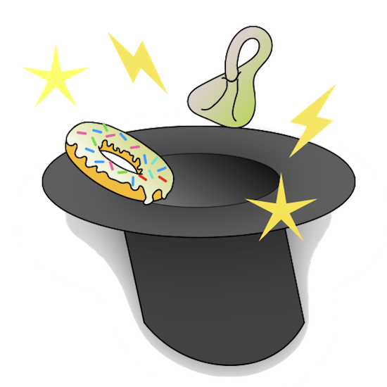
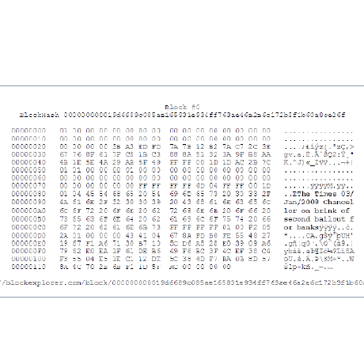

class: center, middle, borderless

<div class="banner">

</div>

# TDA of timeseries

### A introduction and case study of Topological Data Analysis.

<p class="smallish">
<b>Nathaniel Rivera Saul</b><br>
.smallish[New Relic Unconf<br>June 13th 2019]
</p>

---

class: center, middle, qs

<!-- Topological Data Analysis is a new field of applicable mathematics gaining attention in the world of data science. This talk will introduce everything TDA working from holes and nerves to persistence. We'll then explore an application of TDA to time series analysis using new open source tools.  -->

# Topological Data Analysis

**What is topology?**

**Persistent Homology**

~~**Mapper**~~

<br>
# Case Study

**Anomaly Detection**

---

# What is Topology?

.center[
*Something about* **donuts** *and* **coffee cups**?
]


---

## What is Topology?

.center[study of shape, holes, and connectivity.

.fit[]
]

.footnote[Image credit Henry Segerman]

---

## What is Topological Data Analysis?

.center[
apply these theories to high dimensional point cloud data

.fit[
]
]

---

## Clustering is TDA!

.cols[
.fifty[
.fit[]
]

.fifty[
.fit[]
]
]

.center[zero dimensional holes]

---

## High dimensional holes

.cols[
.thirty[
.center[
.fit[]

1d holes = loops
]]

.thirty[
.center[
.fit[]

2d holes = voids
]]

.thirty[
.center[
.fit[]

lots of combinations
]
]
]

---

class: center, middle, qs

# Persistent Homology

<hr>

<br>

**Simplicial Complexes**

**Homology**

**Persistence & Filtrations**

**Persistent Homology & Diagrams**

---

class: center

## Simplicial Complexes

.center[
.fitheight[]
]

.footnote[Image credit wikipedia?]

---

class: center

## Compute homology

Count the k-**cycles** that are not **boundaries** of k+1-cycles

.fitheight[]

---

class: center

## Data &rarr; Complex

---

class: center

## Data &rarr; Complex


---

class: center, middle

# One radius can be misleading


---

class: center, middle

# tinyurl.com/cech-playground


---

## Persistent homology

.center[
.fitheight[]
]

.footnote[Image credit Robert Ghrist]

---

## Persistence diagrams

.cols[
.thirty[
.center[.fit[]<br>.fit[]]
]
.thirty[
.center[.fit[]<br>.fit[]]
]
.thirty[
.center[.fit[]<br>.fit[]]
]
]

---

class: center, middle, qs

### Case Study

<hr/>
<br>
<br>

# TDA of timeseries

**Spike detection**

**Change detection**

---

class: center, middle

Collect data with chart builder


---

class: center, middle

Can we use TDA to detect this spike?


---

class: center, middle, qs

## Processing steps

<hr>
<br>

**Compute length of a period using autocorrelation**

**Construct sliding window embedding for normal wave and spike**

**Compare Persistence Diagrams of both embedding**

---

class: center, middle

Compute period from autocorrelation curve


---

class: center, middle

Pretty okay automatic identification ¯\\\_(ツ)\_/¯


---

class: center, middle

Window size of 30 &rarr; 30 dimensional space.

Slide window length 30 over series.

Each window becomes 30-D vector.

.footnote[please let me know if you have a nice way of visualizing this.]

---

class: center, middle


---

class: center, middle


---

class: center

# Woah those look pretty different to me.


---

class: center

But looks aren't everything.

Can't we automatically tell if they are different?

---

class: center, middle, qs

### Case study

<hr>

## Change detection


Can we tell this periodic signal _fell apart_?

---

class: center, middle


Detect length period

Embed 10 periods

Persistence Diagrams for each group

---

class: center, middle

<!--  -->


---

class: outline

# Scikit-TDA

## What is it?

## Highly open source

## Highly collaborative

## Highly documented

## Used!

---

## What is it?

<br><br>

.center[
| Ripser.py | Kepler Mapper | Persim | Cechmate | TaDAsets |
|---|---|---|---|---|
| .smallimg[] | .smallimg[] | .smallimg[] | .smallimg[] | .smallimg[] |
]

---

## Highly open source

.fit[]

---

## Highly documented

.fit[]

---

## Highly collaborative

.center[
| .smallfixed[] | .smallfixed[] | .smallfixed[] | .smallfixed[] | .smallfixed[] | .smallfixed[] |.smallfixed[] |
|---|---|---|---|---|---|
| .smallfixed[] | .smallfixed[] | .smallfixed[] | .smallfixed[] | .smallfixed[] | .smallfixed[] | .smallfixed[] |
| .smallfixed[] | .smallfixed[] | .smallfixed[] | .smallfixed[] | .smallfixed[] |.smallfixed[] |.smallfixed[] |
| .smallfixed[] | .smallfixed[] | .smallfixed[] | .smallfixed[] | .smallfixed[] | ||
]

---

## Persistent Homology with Ripser.py

Very fast for point clouds

```Python
from ripser import Rips

rip = Rips()
diagrams = rip.fit_transform(data)
rip.plot(diagrams)
```

---

## Flexible diagrams with Cechmate

```Python
import cechmate

cech = cechmate.Cech()
rips = cechmate.Rips()
alpha = cechmate.Alpha()
jaccard = cechmate.Cover()
extended = cechmate.Extended.from_kmapper(mapper)
```

Pretty much the same API for all of them:

```Python
jaccard.build(data)
diagrams = jaccard.diagrams()
jaccard.plot(diagrams)
```

---

background-image: url(images/mapper/breast-cancer.png)

## Mapper with Kepler Mapper

```Python
from kmapper import KeplerMapper
km = KeplerMapper()
lens = km.fit_transform(data, projection=[0])
graph = km.map(lens, data)
km.visualize()
```

---

## datasets with TaDAsets

```Python
import tadasets

loop = tadasets.dsphere(d=1, n=2000, noise=0.1)
sphere = tadasets.dsphere(d=2, n=1000)
torus = tadasets.torus(n=1000, ambient=100)
swiss_roll = tadasets.swiss_roll(n=1000, r=25)
```

.cols[
.thirty[
.center[.fit[]]
]
.thirty[
.center[.fit[]]
]
.thirty[
.center[.fit[]]
]
]

---

## distances with Persim

```Python
import persim

dx = persim.heat(diagramA, diagramB)
dx = persim.bottleneck(diagramA, diagramB)
dx = persim.sliced_wasserstein(diagramA, diagramB)
ims = persim.PersImage().fit_transform(diagrams)
```

.center[
.fullsize[]
]

---

name: questions
class: center, middle, qs

# Questions?

## Thank you!

-- Christopher Tralie

<br>

.center[
<i class="fab fa-twitter"></i> <br>
@scikit_tda <br>
@NathanielSaul

<i class="fas fa-globe"></i> <br>
scikit-tda.org
]

<br>
