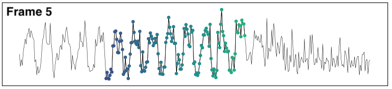

class: center, middle, borderless

<div class="banner">

</div>

# Scikit-TDA
Topological Data Analysis for the Python ecosystem.
<p class="smallish">
<b>Nathaniel Rivera Saul</b><br>
.smallish[Scipy<br>July 2019]
</p>

---

# Preface

- Before Scikit-TDA 
    - Lots of different tools. 
    - Large amounts of feature overlap. 
    - Small amounts of interoperability.

- After Scikit-TDA
    - Lots of different tools + 1 more.

- Our objectives
    - Curate implementations rather than building new ones.
    - Build something that was easy to use. 
    - Build something people could contribute to.

---

# Preface


.cols[
.fifty[
- Easy installation. 

- Lots of documentation.

- Easy to contribute.

] 

.fifty[
``` Python
pip install sktda
```

``` Python
www.scikit-tda.org
```

``` Python
www.github.com/scikit-tda
```
]
]


---

class: center, middle

# Preface

.center[
| .smallfixed[] | .smallfixed[] | .smallfixed[] | .smallfixed[] | .smallfixed[] | .smallfixed[] |.smallfixed[] |
|---|---|---|---|---|---|
| .smallfixed[] | .smallfixed[] | .smallfixed[] | .smallfixed[] | .smallfixed[] | .smallfixed[] | .smallfixed[] |
| .smallfixed[] | .smallfixed[] | .smallfixed[] | .smallfixed[] | .smallfixed[] |.smallfixed[] |.smallfixed[]  |
| .smallfixed[] | .smallfixed[] | .smallfixed[] | .smallfixed[] | .smallfixed[] | ||
]
---

class: center, middle, qs

# Outline

<hr>

**Topological Data Analysis**

**Controlled Examples**

**Anomaly Detection**

---

class: center, middle

## Topology

.center[study of _shape_, **holes**, and **_connectivity_**.

.fit[]
]

.footnote[Image credit Henry Segerman]

---

class: center, middle

## Topological Data Analysis


<br>
Adapt topology to point cloud data.

---

class: center, middle

## Clustering is TDA!

.cols[
.fifty[
.fit[]
]

.fifty[
.fit[]
]
]

.center[zero dimensional holes]

---

class: center, middle

## High dimensional holes

.cols[
.thirty[
.center[
.fit[]

1d holes = loops
]]

.thirty[
.center[
.fit[]

2d holes = voids
]]

.thirty[
.center[
.fit[]

lots of combinations
]
]
]


---


class: center, middle

## Data &rarr; Complex


---

class: center, middle

## One radius can be misleading


---

class: center, middle

## Look at entire sequence of radii


tinyurl.com/cech-playground

---

class: center

## Persistent homology

.center[
.fitheight[]
]

.footnote[Image credit Robert Ghrist]

---

class: center, middle, qs

# Outline

<hr>

~~**Topological Data Analysis**~~

**Controlled Examples**

**Anomaly Detection**


---

# Constrolled Examples

.cols[
.thirty[

]
.thirty[
``` Python
loop = tadasets.dsphere(d=1)
dgms = ripser(loop)
persim.plot_diagrams(dgms)
```
]
.thirty[

]
]

.center[


]
---


# Controlled examples

.cols[
.thirty[

]
.thirty[
``` Python
sphere = tadasets.dsphere(d=2)
dgms = ripser(sphere)
persim.plot_diagrams(dgms)
```
]
.thirty[

]
]

.center[


]

---


# Controlled examples

.cols[
.thirty[

]
.thirty[
``` Python
torus = tadasets.torus()
dgms = ripser(torus)
persim.plot_diagrams(dgms)
```
]
.thirty[

]
]


.center[


]


---


class: center

## Comparison

.cols[
.thirty[
.center[.fit[]<br>.fit[]]
]
.thirty[
.center[.fit[]<br>.fit[]]
]
.thirty[
.center[.fit[]<br>.fit[]]
]
]


---

class: center

# Comparison

- Show distances between multiple diagrams
- Show distances with varying levels of noise.

---

class: center, middle, qs

# Outline

<hr>

~~**Topological Data Analysis**~~

~~**Controlled Examples**~~

**Anomaly Detection**


<!-- ---

class: center, middle, qs

### Case study

<hr>

## Anomaly detection

Sliding window embedding

Persistent homology of embedding

Comparison of Persistence diagrams -->

---

class: center, middle

## Time series data


<small> Average duration of web transactions aggregated over ~5 seconds.</small>

Can we tell when this periodic signal _falls apart_?

---

class: center, middle

## Preprocessing

<br>
Autocorrelation curve

<br>
Periods found from peak 

<!-- ---

class: center, middle

# Sliding window embedding

Window size of 3 &rarr; 3 dimensional space.

Each window becomes 3-D vector.


.footnote[Image credit Jose Perea.] -->

---

class: center, middle

# Sliding window embedding


.footnote[Gif credit Chris Tralie]

---

class: center, middle

``` Python
diagrams = Rips().fit_transform(embedding)
persim.plot_diagrams(diagrams)
```


---

class: center, middle

## Wasserstein distances

``` Python
d = persim.wasserstein(diagram3, diagram5)
```

<br>
<br>



<!-- ---

class: center, middle, qs

### Case study

<hr>

## Classification

Level set persistence

Persistence images

Classification algorithms -->


---

# Next time

- Persistence images
- TDA of machine learning
- Mapper and Sheaves

---

# Sprint

- Help with conda-forge packaging
- Help with automated builds


---

# Thank you

- Chris Tralie
- Leland McInnes

---

name: questions
class: center, middle, qs

Thank you to &#9734; Chris Tralie &#9734;

<hr>

.cols[
.thirty[
<br>

### Learn more &#10132;

]


.fifty[
<i class="fab fa-slack"></i><br>
tinyurl.com/scikit-tda-slack

<i class="fas fa-globe"></i> <br>
www.scikit-tda.org
]

]

<hr>

<br>

# Questions?

---

class: outline

# References

Embedding technique:

- (Quasi)Periodicity Quantification in Video Data, Using Topology, Christopher J. Tralie, Jose A. Perea, https://arxiv.org/abs/1704.08382

Beautiful diagram of the persistence barcode

- R. Ghrist, “Barcodes: The persistent topology of data,” Bulletin-American Mathematical Society 45, 1-15 (2008). [PDF in AMS](http://www.ams.org/journals/bull/2008-45-01/S0273-0979-07-01191-3/S0273-0979-07-01191-3.pdf)

Notebooks to reproduce case study

- [www.github.com/sauln/scipy-2019](www.github.com/sauln/scipy-2019)